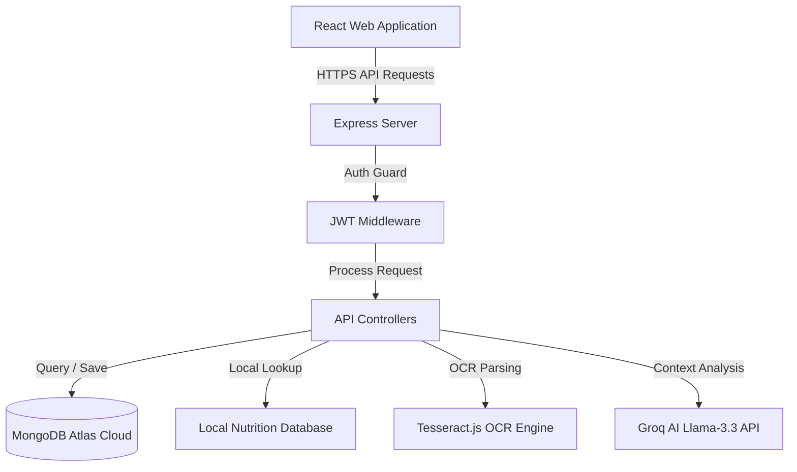

# 🩺 Wellora – AI Health Companion

Wellora is a state-of-the-art MERN-stack health platform designed to empower users on their wellness journey. It integrates comprehensive tracking modules for hydration, sleep, and mood with a real-time **Health Score** calculator. The platform also features an offline-first **Nutrition Coach** with a local database of 310+ common foods, a context-aware **AI Health Assistant**, and an **AI Medical Report Simplifier** that translates complex clinical reports into patient-friendly summaries using optical character recognition (OCR) and LLM analysis.

---

## 🚀 Key Features

### 👤 User Authentication
* **JWT Security**: Secure signup, login, and authorization handling.
* **Persistent Sessions**: Automated login sessions backed by persistent frontend context tokens.
* **Onboarding Wizard**: Custom profiling for user height, weight, bedtime, and hydration goals.

### 📊 Wellness Tracker & Analytics
* **Water Hydration**: Daily intake logging with responsive goal circles.
* **Sleep Tracker**: Record bedtime, wakeup time, and quality markers (Poor, Fair, Good, Excellent).
* **Mood Logger**: Track emotional state and log historical moods.
* **Health Analytics**: Clean, responsive Recharts layouts charting weekly water intake and sleep logs.

### 📈 Daily Health Score
* **Real-time Scoring**: Client-side calculation mapping daily habits (Sleep: 40%, Hydration: 30%, Mood: 30%) to a 0-100 score.
* **Featured Display Card**: Circular animated progress ring with health status indicators (Poor, Fair, Good, Excellent) and dynamic wellness insights.
* **Zero-Default Safety**: Cleans up missing logs cleanly without layout shifts or NaNs.

### 🔥 Daily Wellness Streaks
* **Logging Streaks**: Tracks consecutive calendar days where users successfully record hydration, sleep, and mood.
* **Milestone Badges**: Rewarding user consistency:
  * `3+ Days`: 🌱 Getting Started
  * `7+ Days`: 🔥 Consistent
  * `14+ Days`: ⭐ Healthy Habit
  * `30+ Days`: 🏆 Wellness Champion

### 🍎 Nutrition Coach
* **Local Food Matcher**: Search engine checking a local database of **310+ common foods** (spanning fruits, dairy, street food, beverages, and traditional Indian snacks).
* **Groq AI Fallback**: Automated AI matching mapping unknown food requests to structured nutritional values using LLM prompts.
* **Diet suggestions**: Offline Vegetarian and Non-Vegetarian suggestions rotated dynamically based on user Health Score.

### 📄 Medical Report Simplifier
* **Multi-Format Uploads**: Support for PDFs and images (PNG, JPG, JPEG, and WEBP).
* **Dual-Path Text Extraction**: Selective extraction from selectable PDFs and automated Tesseract OCR fallback for scanned reports.
* **Document Validation**: Verifies medical report validity to prevent invalid analyses (e.g. resumes, receipts).
* **Jargon-free Explanations**: Groq AI summary translates complex parameters (Haemoglobin, WBC, Cholesterol, etc.) into simplified tables.

---

## 💻 Tech Stack

### Frontend
* **React.js (v19)** — Component architecture
* **Tailwind CSS (v4)** — Styling and responsive layout rules
* **Recharts** — Weekly progress charting
* **Framer Motion** — Interface transitions and animations
* **Axios** — HTTP client requests

### Backend
* **Node.js & Express.js** — REST API backend router
* **MongoDB & Mongoose** — Document schemas and database storage
* **JWT & Bcrypt.js** — Secure passwords and token signatures

### AI & Integrations
* **Groq AI Node Client** — Llama-3.3-70b-versatile model API calls
* **Tesseract.js** — Client/Server-side optical character recognition

---

## 🏗️ Architecture Overview



---

## 🛠️ Folder Structure

```
wellora-ai-health-companion/
├── backend/
│   ├── config/            # DB connection setup
│   ├── controllers/       # Router functions (auth, sleep, reports, etc.)
│   ├── middleware/        # Auth verification middlewares
│   ├── models/            # Mongoose database schemas
│   ├── routes/            # API routing endpoints
│   ├── utils/             # Helper databases, meal lists, OCR validators
│   ├── index.js           # Server runner script
│   └── package.json
└── frontend/
    ├── src/
    │   ├── components/    # Navigation, layouts, skeleton cards
    │   ├── context/       # Data context cache providers
    │   ├── pages/         # Page modules (Dashboard, Coach, Analytics)
    │   ├── utils/         # API HTTP configurations
    │   ├── App.jsx        # Routing rules
    │   └── main.jsx       # DOM bootstrapper
    ├── package.json
    └── vite.config.js
```

---

## 🔗 REST API Endpoints

### 🔐 Authentication
* `POST /api/auth/signup` — Create a new user account.
* `POST /api/auth/login` — Login and fetch JWT token.

### 👤 User Profile & Streaks
* `POST /api/user/onboard` — Complete onboarding parameters (protected).
* `GET /api/user/streak` — Retrieve user's consecutive wellness logging streak (protected).

### 💧 Hydration Tracker
* `GET /api/hydration` — Fetch today's logged water intake (protected).
* `POST /api/hydration` — Add daily water consumption (protected).
* `DELETE /api/hydration/today` — Reset today's hydration logs (protected).

### 🌙 Sleep Tracker
* `GET /api/sleep` — Fetch latest logged sleep metrics (protected).
* `POST /api/sleep` — Log sleep duration and quality (protected).
* `DELETE /api/sleep/today` — Reset today's sleep metrics (protected).

### 😊 Mood Tracker
* `GET /api/mood` — Get today's latest mood log (protected).
* `POST /api/mood` — Log daily emotional state (protected).
* `DELETE /api/mood/:id` — Delete specific mood log entry (protected).

### 🍎 Nutrition Coach
* `GET /api/nutrition/search?q=<food>` — Search nutrition information in offline DB or fallback to AI (protected).
* `GET /api/nutrition/suggestions?preference=<pref>` — Retrieve meal suggestions based on Health Score (protected).

### 📄 Medical Report Simplifier
* `POST /api/medical-reports/upload` — Parse medical report (PDF/image) using OCR and AI (protected).
* `GET /api/medical-reports` — List past uploaded medical report logs (protected).

---

## ⚙️ Installation Guide

### Prerequisites
* **Node.js** (v18 or higher recommended)
* **MongoDB** (Local instance or MongoDB Atlas URI)
* **Groq API Key** (Obtain from [Groq Console](https://console.groq.com/))

### 1. Clone the Repository
```bash
git clone https://github.com/your-username/wellora-ai-health-companion.git
cd wellora-ai-health-companion
```

### 2. Configure Environment Variables
Create a `.env` file in the `backend/` directory:
```env
PORT=5000
MONGODB_URI=your_mongodb_atlas_connection_string
JWT_SECRET=your_jwt_signing_secret_key
GROQ_API_KEY=your_groq_developer_api_key
NODE_ENV=development
```

### 3. Install Dependencies
Run the install helper script in the root directory:
```bash
npm run install-all
```
*Alternatively, run `npm install` inside both `backend/` and `frontend/` folders.*

### 4. Run the Project
Start both development environments concurrently from the root directory:
```bash
npm run dev-all
```
The app will serve:
* **Frontend Client**: `http://localhost:5173` (or port listed in console)
* **Backend API Server**: `http://localhost:5000`

---

## 🌐 Deployment

### Frontend (Vercel)
1. Set up a Vercel project linked to your repository.
2. In frontend build configurations, configure the root directory to `frontend/`.
3. Set the build command to `npm run build` and output directory to `dist/`.
4. Deploy the application.

### Backend (Render)
1. Create a new Web Service on Render linked to your repository.
2. Configure the root directory to `backend/`.
3. Set the runtime to `Node`.
4. Define the start command as `npm start`.
5. Set environment variables (`MONGODB_URI`, `JWT_SECRET`, `GROQ_API_KEY`) under the Environment tab.
6. Deploy the service.

---

## 🔮 Future Enhancements
* **Report Trend Charting**: Track metrics (e.g. cholesterol, hemoglobin) across multiple consecutive reports to chart progress.
* **Multi-Language Support**: Translate simplified medical report summaries into regional languages.
* **Calorie Budgeting**: Track daily food logs against custom calorie goals.

---

## ✍️ Author
* **Priyanshu Suyal** — [GitHub](https://github.com/Priyanshu12334)

---

## 📄 License
This project is licensed under the MIT License.
