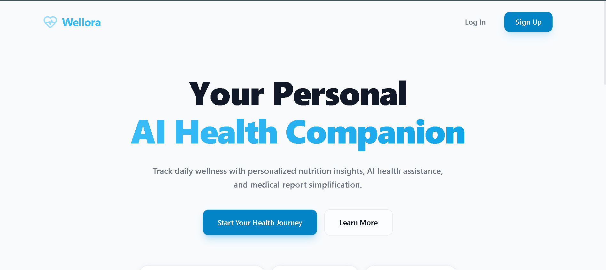
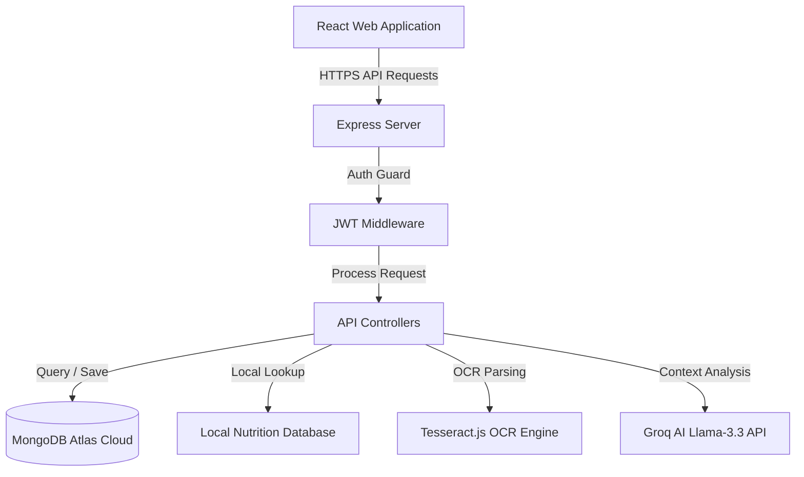

# Wellora – AI Health Companion

Wellora is a full-stack health and wellness platform that helps users track hydration, sleep, and mood. It also provides wellness analytics, nutrition suggestions, an AI health assistant, and AI-powered medical report summaries.



---

## 🚀 Key Features

### 👤 User Authentication

- **JWT Authentication** — Secure signup, login, and protected access.
- **Persistent Sessions** — Maintains user authentication across sessions.

### 📊 Wellness Tracking & Analytics

- **Hydration Tracking** — Log daily water intake and track hydration goals.
- **Sleep Tracking** — Record sleep duration and quality.
- **Mood Tracking** — Log daily mood and view mood history.
- **Health Analytics** — Visualize weekly hydration, sleep, and mood trends.

### 🔥 Daily Wellness Streaks
* **Logging Streaks**: Tracks consecutive calendar days where users successfully record hydration, sleep and mood.
* **Milestone Badges**: Rewarding user consistency:
  * `3+ Days`: 🌱 Getting Started
  * `7+ Days`: 🔥 Consistent
  * `14+ Days`: ⭐ Healthy Habit
  * `30+ Days`: 🏆 Wellness Champion

### 🍎 Nutrition Coach
* **Local Food Matcher**: Search engine checking a local database of **310+ common foods** (spanning fruits, dairy, street food, beverages, and traditional Indian snacks).
* **Groq AI Fallback**: Automated AI matching mapping unknown food requests to structured nutritional values using LLM prompts.
* **Diet suggestions**: Offline Vegetarian and Non-Vegetarian suggestions rotated dynamically based on user Daily Wellness Score.

### 📄 Medical Report Simplifier
* **Multi-Format Uploads**: Support for PDFs and images (PNG, JPG, JPEG, and WEBP).
* **Document Validation**: Verifies medical report validity to prevent invalid analyses (e.g. resumes, receipts).

---

## 💻 Tech Stack

### Frontend

- **React.js**
- **Tailwind CSS**
- **Recharts**
- **Framer Motion**
- **Axios**

### Backend

- **Node.js**
- **Express.js**
- **MongoDB**
- **Mongoose**
- **JWT**
- **bcrypt.js**

### AI & Integrations

- **Groq AI**
- **Tesseract.js**
- **OCR & LLM-based Processing**

---

## 🏗️ Architecture Overview


```mermaid
graph TD
    Client[React Web Application] -->|HTTPS API Requests| Express[Express Server]
    Express -->|Auth Guard| Middle[JWT Middleware]
    Middle -->|Process Request| Controller[API Controllers]
    Controller -->|Query / Save| MongoDB[(MongoDB Atlas Cloud)]
    Controller -->|Local Lookup| NutritionDB[Local Nutrition Database]
    Controller -->|OCR Parsing| Tesseract[Tesseract.js OCR Engine]
    Controller -->|Context Analysis| Groq[Groq AI Llama-3.3 API]
```

---

## 🛠️ Folder Structure

```
ai-health-companion/
│
├── backend/
│   ├── config/
│   ├── controllers/
│   ├── middleware/
│   ├── models/
│   ├── routes/
│   ├── utils/
│   ├── index.js
│   └── package.json
│
├── frontend/
│   ├── public/
│   ├── src/
│   │   ├── components/
│   │   ├── context/
│   │   ├── pages/
│   │   ├── utils/
│   │   ├── App.jsx
│   │   ├── main.jsx
│   │   └── index.css
│   ├── .env
│   ├── package.json
│   └── vite.config.js
│
├── .gitignore
├── README.md
```

---

## 🔗 REST API Endpoints

### 🔐 Authentication
* `POST /api/auth/signup` — Create a new user account.
* `POST /api/auth/login` — Login and fetch JWT token.

### 👤 User Profile & Streaks
* `POST /api/user/onboard` — Complete onboarding parameters (protected).
* `GET /api/user/streak` — Retrieve user's consecutive wellness logging streak (protected).

### 💧 Hydration Tracker
* `GET /api/hydration` — Fetch today's logged water intake (protected).
* `POST /api/hydration` — Add daily water consumption (protected).
* `DELETE /api/hydration/today` — Reset today's hydration logs (protected).

### 🌙 Sleep Tracker
* `GET /api/sleep` — Fetch latest logged sleep metrics (protected).
* `POST /api/sleep` — Log sleep duration and quality (protected).
* `DELETE /api/sleep/today` — Reset today's sleep metrics (protected).

### 😊 Mood Tracker
* `GET /api/mood` — Get today's latest mood log (protected).
* `POST /api/mood` — Log daily emotional state (protected).
* `DELETE /api/mood/:id` — Delete specific mood log entry (protected).

### 🍎 Nutrition Coach
* `GET /api/nutrition/search?q=<food>` — Search nutrition information in offline DB or fallback to AI (protected).
* `GET /api/nutrition/suggestions?preference=<pref>` — Retrieve meal suggestions based on Daily Wellness Score (protected).

### 📄 Medical Report Simplifier
* `POST /api/medical-reports/upload` — Parse medical report (PDF/image) using OCR and AI (protected).
* `GET /api/medical-reports` — List past uploaded medical report logs (protected).

---

## ⚙️ Installation Guide

### Prerequisites
* **Node.js** (v18 or higher recommended)
* **MongoDB** (Local instance or MongoDB Atlas URI)
* **Groq API Key** (Obtain from [Groq Console](https://console.groq.com/))

### 1. Clone the Repository
```bash
git clone https://github.com/your-username/wellora-ai-health-companion.git
cd ai-health-companion
```

### 2. Configure Environment Variables
Create a `.env` file in the `backend/` directory:
```env
PORT=5000
MONGODB_URI=your_mongodb_atlas_connection_string
JWT_SECRET=your_jwt_signing_secret_key
GROQ_API_KEY=your_groq_developer_api_key
NODE_ENV=development
```

### 3. Install Dependencies
Run the install helper script in the root directory:
```bash
npm install
```
*Alternatively, run `npm install` inside both `backend/` and `frontend/` folders.*

### 4. Run the Project
Start both development environments concurrently from the root directory:
```bash
npm run dev
```
The app will serve:
* **Frontend Client**: `http://localhost:5173` 
* **Backend API Server**: `http://localhost:5000`

---

## 🌐 Deployment

### Frontend (Vercel)
1. Set up a Vercel project linked to your repository.
2. In frontend build configurations, configure the root directory to `frontend/`.
3. Set the build command to `npm run build` and output directory to `dist/`.
4. Deploy the application.

### Backend (Render)
1. Create a new Web Service on Render linked to your repository.
2. Configure the root directory to `backend/`.
3. Set the runtime to `Node`.
4. Define the start command as `npm start`.
5. Set environment variables (`MONGODB_URI`, `JWT_SECRET`, `GROQ_API_KEY`) under the Environment tab.
6. Deploy the service.

---

## 🌐 Live Demo

* Experience Wellora live here: https://ai-health-companion-phi.vercel.app

## 🔮 Future Enhancements
* **Report Trend Charting**: Track metrics (e.g. cholesterol, hemoglobin) across multiple consecutive reports to chart progress.
* **Multi-Language Support**: Translate simplified medical report summaries into regional languages.
* **Calorie Budgeting**: Track daily food logs against custom calorie goals.

---

## ✍️ Author
* **Priyanshu Suyal** — [Portfolio](https://portfolio-ten-blond-87.vercel.app)
* **Priyanshu Suyal** — [Linkedin](https://www.linkedin.com/in/priyanshu-suyal-5732b224a/)
* **Priyanshu Suyal** — [GitHub](https://github.com/Priyanshu12334)

---
